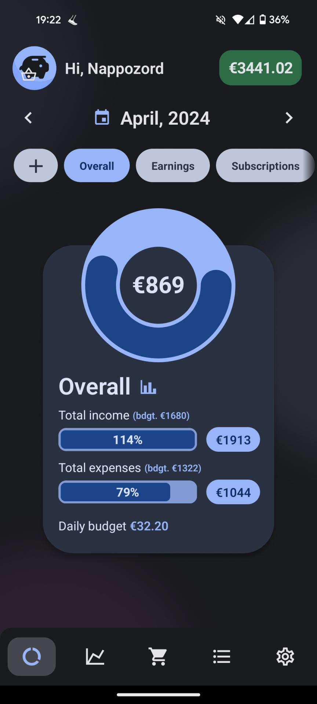
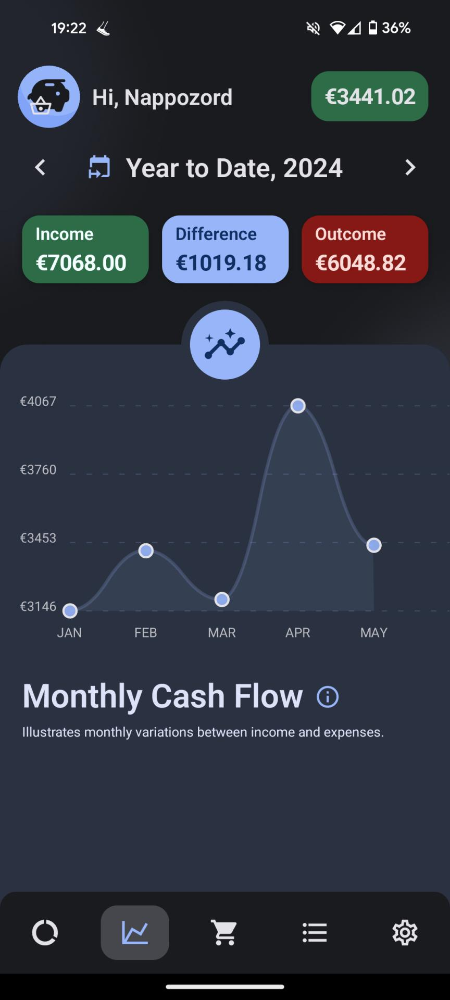
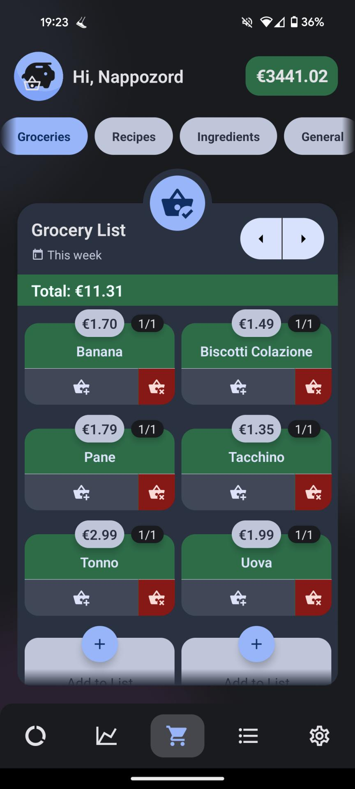
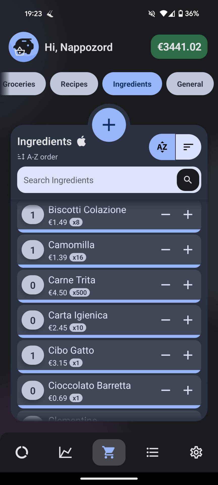
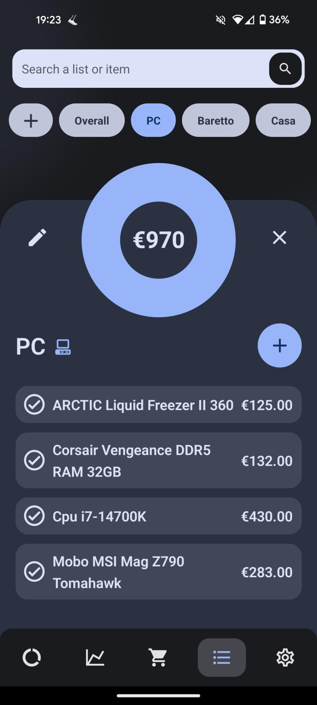
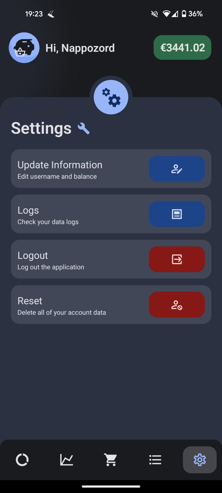

# Life - Monthly Expense Tracker

Life is a simple and intuitive monthly expense tracking app designed to help users manage their finances effectively. With Life, you can effortlessly track your expenses, set budgets for different categories, and analyze your spending habits over time.

## Features

- **Expense Tracking:** Easily log your monthly expenses and categorize them for better organization.
- **Budget Setting:** Set budgets for various expense categories to help you stay on track financially.
- **Yearly Statistics:** Analyze your yearly financial trends with insightful graphical representations.
- **Grocery and Meal Tracking:** Keep track of your grocery purchases and daily meals to monitor food expenses.
- **Recipe Collection:** Store your favorite recipes within the app for easy access and meal planning.
- **List Making:** Create and manage lists for tasks, shopping, or personal goals.

## Getting Started

To get started with Life, simply clone the repository to your local machine and follow the instructions in the [documentation](docs/README.md).

## Usage

1. **Installation:** Install the necessary dependencies using `npm install`.
2. **Configuration:** Customize your expense categories and budgets in the settings.
3. **Logging Expenses:** Log your expenses daily and categorize them accordingly.
4. **Analyzing Data:** Use the graphical representations to analyze your spending patterns and adherence to budgets.
5. **Additional Features:** Explore the grocery tracking, meal logging, recipe collection, and list-making functionalities.

## Screenshots

  
  
  

  
  
  

## Contributing

Contributions are welcome! If you'd like to contribute to Life, please check out the [contribution guidelines](CONTRIBUTING.md) before getting started.
